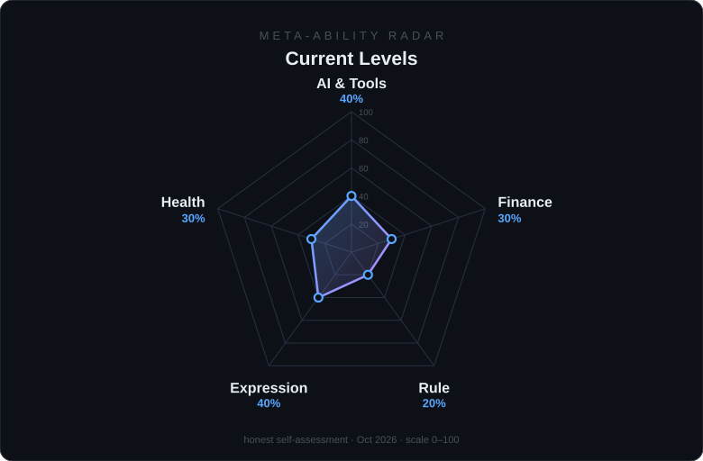

**Focus** · Hong Kong 🇭🇰 · [𝕏 @JingLW695](https://x.com/JingLW695)

`Indie Developer` `Digital Nomad` `Web3` `Infrastructure`

---

### 👋 About

- 🔭 Founder of **[RealityLink](https://github.com/RealityLink-Tech)** — cooking the **spatial web**, bridging digital and physical reality.
- 🌏 Indie developer & digital nomad — remote-first, building products that fit real life, not fight it.
- 📈 Cross-domain learning in progress: **finance & investing × marketing**.

> 远程办公 + 独立创业，打造可契合现实生活的产品

---

### 🧭 Meta-Ability Radar · 元能力塑造

| | Ability | What it's for | Now |
|---|---|---|---|
| 🤖 | **AI & Digital Tools** | Efficiency leverage — amplify one-person productivity | `40%` |
| 💰 | **Money & Asset Management** | Cash flow, asset building, resilience to economic risk | `30%` |
| ⚖️ | **Rules & Rights** | Read contracts & rules, know boundaries, protect yourself | `20%` |
| 🗣️ | **Communication & Sales** | Win opportunities, resources and better deals; create content that moves people | `40%` |
| 🫀 | **Health & Emergency** | Sleep, diet, exercise, basic medical & first-response know-how | `30%` |

*Ship · Earn · Protect · Express · Endure*

> Self-assessed honest levels — the plan is to raise every axis. Last updated 2026-10.

---

### 🚧 Now Building

| Project | What it is | Stack | Stars |
|---|---|---|---|
| 🛝 [xiulema](https://github.com/Focus695/xiulema) · [xiulema.date](https://xiulema.date) | A workplace rest-record sharing site — log, track and share how work really wears you down | `TypeScript` |  |
| 🤖 [BoCode](https://github.com/Focus695/BoCode) | A human–agent development workflow template — how I ship software hand-in-hand with AI agents | `JavaScript` |  |

### 🚀 Featured Work

| Project | What it is | Stack | Stars |
|---|---|---|---|
| 🌙 [MoonHub](https://github.com/RealityLink-Tech/MoonHub) | Core product of RealityLink — cooking the spatial web | `Go` |  |
| 📱 [MoonHub-PWA](https://github.com/RealityLink-Tech/MoonHub-PWA) | Progressive web app client for MoonHub | `TypeScript` |  |
| 🛒 [CAC](https://github.com/Focus695/CAC) | PWA e-commerce site with full admin backend | `TypeScript` |  |
| 🧩 [Claito](https://github.com/Focus695/Claito) | Python tooling experiments | `Python` |  |

---

### 🧰 Toolbox

---

### 📊 GitHub Stats

---

💌 Find me on

